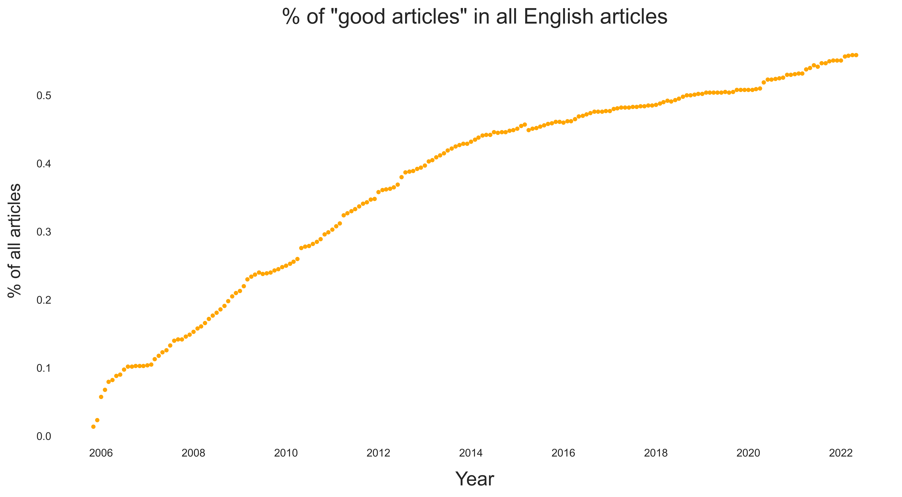
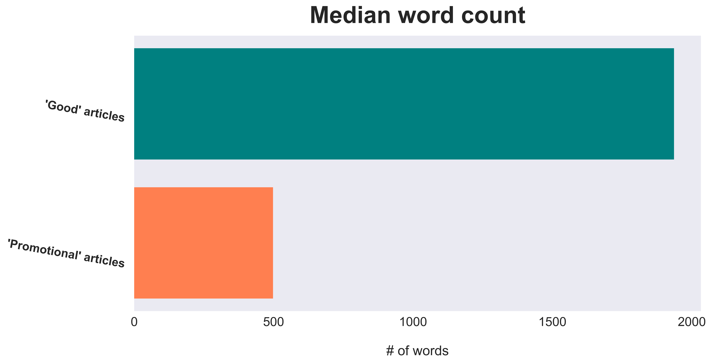
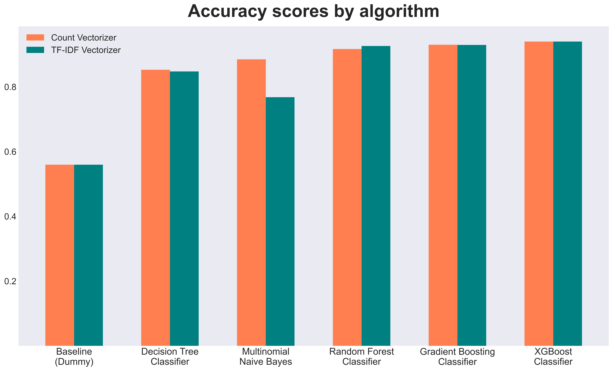
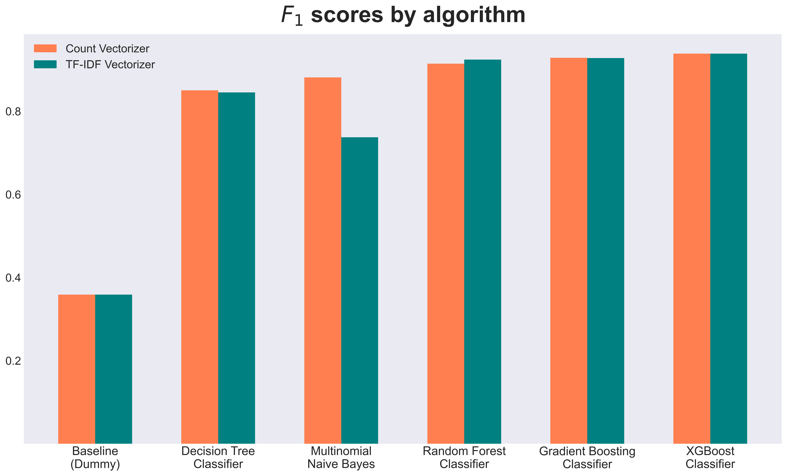

# Predicting Wikipedia Article Quality Using Natural Language Processing


*(photo courtesy of Dmitrij Paskevic, hosted on [Unsplash](https://unsplash.com/photos/YjVa-F9P9kk);
good article [symbol](https://en.wikipedia.org/wiki/Wikipedia:Good_articles#/media/File:Symbol_support_vote.svg) by Zscout370, improved by Ed g2s, simplified by Erin Silversmith; article for improvement star symbol by Booyabazooka and Mark Miller)*

## Authors

- **Luke Dowker** ([GitHub](https://github.com/toastdeini) | [LinkedIn](https://www.linkedin.com/in/luke-dowker/) | [Email](mailto:lhdowker@gmail.com))

## Overview

Over the course of its twenty-plus-year existence, Wikipedia's reputation has gradually evolved from that of a [digital "Wild West"](https://www.cnn.com/2009/TECH/08/26/wikipedia.editors/index.html), [replete with misinformation](https://usatoday30.usatoday.com/news/opinion/editorials/2005-11-29-wikipedia-edit_x.htm), to that of a [meticulously curated](https://en.wikipedia.org/wiki/Vandalism_on_Wikipedia#Prevention) and (generally) reliable resource for [fact-checking](https://en.wikipedia.org/wiki/Wikipedia_and_fact-checking) & bird's-eye/survey-level research.

The site's reliability and ongoing improvement can be attributed, in large part, to the fastidiousness of Wikipedia's volunteer editors, who have been using Bayesian statistics for at least fifteen years now to identify ["vandalism"](https://en.wikipedia.org/wiki/Wikipedia:Vandalism) - bad-faith edits "deliberately intended to obstruct" the distribution of verifiable, open-source knowledge - with scripts like [ClueBot](https://en.wikipedia.org/wiki/User:ClueBot_NG). The steadily increasing proportion of "[good articles](https://en.wikipedia.org/wiki/Wikipedia:Good_article_statistics)" is the direct result of a concerted, altruistic effort by English speakers across the world to create an accessible, democratized encyclopedia.



Regrettably, not everyone who fires up their computer (or phone!) to edit Wikipedia has equally noble intentions. Though the site's policy makes clear that Wikipedia is "[**not** a soapbox or means of promotion](https://en.wikipedia.org/wiki/Wikipedia:What_Wikipedia_is_not#Wikipedia_is_not_a_soapbox_or_means_of_promotion)" (emphasis mine), upwards of 20,000 articles on the site fail to purport a neutral point of view, and hundreds of these "[articles with a promotional tone](https://en.wikipedia.org/wiki/Category:Articles_with_a_promotional_tone)" are identified monthly by editors and everyday visitors.

Articles with a slanted perspective present a threat not only to Wikipedia's credibility as a source of knowledge, but also to the average user: without prior knowledge of the subject at hand, how can a reader know if the information they're getting is objective, other than by intuition? This is where machine learning and natural language processing (NLP) enter the picture: a model trained on data that represents the contents of **both "good" and "promotional" articles** will be able to forecast whether a body of text meets an encyclopedic editorial standard, or if the text is likely to be marked by readers as "promotional" and thus not useful.

The final model classifies unseen documents with an accuracy rate hovering **just above 90%** using a term importance (TF-IDF) vectorizer and a classifier that combines multinomial naive Bayes with the popular `XGBoost` library. Users inputting a passage of text into the [application](https://share.streamlit.io/toastdeini/wikipedia-article-quality/main/app_testing.py) that employs this model can be confident that, nine times out of ten, they will know almost immediately if a given Wikipedia is written from a sufficiently neutral point of view, or if the article is more like a glorified advertisement.

## Business Problem

Create a tool/model/application with natural language processing (NLP) that can predict whether a body of text, e.g. a Wikipedia article, meets objective standards of quality or if it is marked by a promotional tone, indicating potential for bias. An effective product will benefit both stakeholders at Wikipedia and the website's users.

## Data

Data used in this project is freely available for download on [Kaggle](https://www.kaggle.com/datasets/urbanbricks/wikipedia-promotional-articles), courtesy of user `urbanbricks`. "[Good articles](https://en.wikipedia.org/wiki/Wikipedia:Good_articles)" - articles which meet a "core set of editorial standards" - were stored as strings (with corresponding URLs) in one CSV file, `good.csv`. Articles with a "[promotional tone](https://en.wikipedia.org/wiki/Category:Articles_with_a_promotional_tone)" were stored in a separate CSV (`promotional.csv`) that, in addition to `text` and `url` columns, contains one-hot encoded columns that identify a subclass of promotional tone, e.g. `advert` (written like an advertisement) or `coi` (conflict of interest with subject).

Inquiry into the distribution of those subclasses led me to adopt a binary classification approach for this project: a **decisive majority** (just under 80%) of documents in `promotional.csv` are labeled as `advert`, while the next most frequently occurring subclass — `resume` — appeared as a tag on 9.2% of the promotional articles. More specialized work in this domain might involve multi-class predictions, but for the purposes of this project, all articles in `promotional.csv` were treated as 'equally promotional' and assigned a label of `1`. The distribution is plotted below.


It is important to note that the classes in discussion here - that is, whether an article meets the criteria for a "good article" or whether its contents are "promotional"/non-neutral - were **evaluated and labeled** by Wikipedia users and editors, and that this dataset (and consequently, these two classes) ***do not*** represent the full corpus of English-language Wikipedia — only a fraction of it, in fact.

A brief inquiry into the *length* of the documents belonging to each class revealed that `good` articles are, on average, about **three to four times longer** than `promotional` articles, and that **more than half** of articles in the `promotional` set are less than 500 words long. This is descriptive, not predictive, but it helps enhance our understanding of the data.


<!-- Display of separate charts:

 -->

## Methods

### Tools Used + Baseline Model

Initial exploration & analysis of the data utilized the [pandas](https://pandas.pydata.org/docs/index.html#) library for Python; exploratory visualizations were created using [matplotlib](https://matplotlib.org/) and [seaborn](https://seaborn.pydata.org/). Preprocessing the data required modules from both [scikit-learn](https://scikit-learn.org/stable/) and [NLTK](https://www.nltk.org/index.html) (Natural Language Toolkit).

Two vectorization methods were tested for each algorithm employed: a simple bag-of-words approach (`CountVectorizer`) and a term importance approach (`TfidfVectorizer`). Results are reported for each vectorizer.

scikit-learn's `DummyClassifier` acted as a baseline model, against which other algorithms could be compared. The `DummyClassifier` returned an accuracy score of **0.56** / 56%, i.e. the proportion of articles matching the majority class (`good` articles) in the dataset. Any algorithm that predicts with a lower accuracy score than the dummy model is effectively worthless, as far as we're concerned, and we'll be looking to improve substantially on that 56% accuracy rate in the iterative modeling process.

### Iterative Modeling

Modeling began with two straightforward classification algorithms: decision trees (`DecisionTreeClassifier`) and multinomial naive Bayes (`MultinomialNB`). With no hyperparameter tuning, cross-validation results were as follows:

- `DecisionTreeClassifier`:
  - `CountVectorizer`
    - Accuracy: `0.872`
    - F1 score (macro): `0.870`
  - `TfidfVectorizer`
    - Accuracy: `0.864`
    - F1 score (macro): `0.861`
- `MultinomialNB`:
  - `CountVectorizer`
    - Accuracy: `0.898`
    - F1 score (macro): `0.896`
  - `TfidfVectorizer`
    - Accuracy: `0.793`
    - F1 score (macro): `0.770`

Even before tuning hyperparamaters, we are seeing improvements from the `DummyClassifier`'s accuracy and F1 scores. This is a good sign, but hardly the end of the road.

Despite its less impressive performance when predicting on a TF-IDF vectorized array, the multinomial naive Bayes classifier was associated with the lowest fitting/scoring time of all the untuned algorithms, without a significant compromise in accuracy. For this reason, the `MultinomialNB` classifier will be further explored in the modeling process.

### Final Model (for Testing and Deployment)

- [XGBoost](https://xgboost.readthedocs.io/en/stable/) documentation

## Results



<!-- F1 scores, if this is preferred:
 -->

<!-- Visualization of error - ROC curve? -->

## Conclusions

- **Recommendation:** Justification
- **Recommendation:** Justification
- **Recommendation:** Justification

### Next Steps

- **Collaborate with administrators of [fandom wikis](https://www.fandom.com/explore) to gather new, high-quality training data:** Articles/text data containing in-depth information on a wider variety of subjects - especially niche ones - than Wikipedia offers might help the model's performance on unseen data.
- **Next step:** Justification
- **Next step:** Justification

## Repository Structure

```text
├── data
├── images
├── models               # Saved models, other objects
├── prep                 # EDA and modeling notebooks
├── src                  # Helper functions and classes
├── app.py               # Streamlit application script
├── README.md
├── presentation.pdf
└── notebook.ipynb       # Final analysis notebook
```

## Further Reading and Citations

- Link to [Jupyter notebook](notebook.ipynb)
- Link to [non-technical presentation](presentation.pdf)
