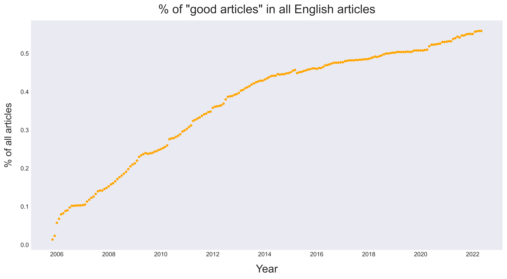
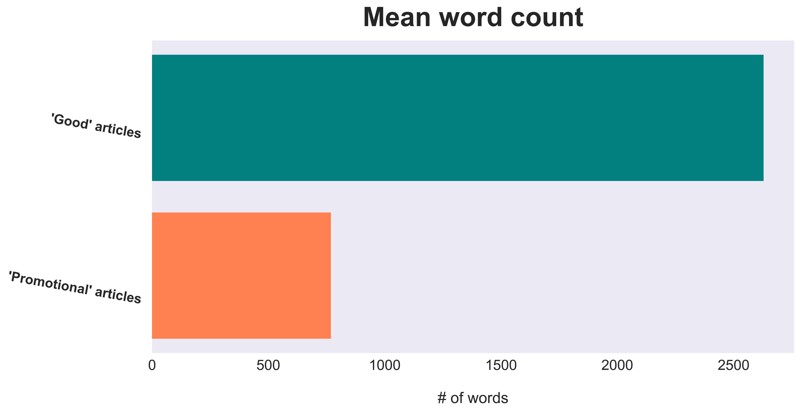

# Predicting Wikipedia Article Quality Using Natural Language Processing


*(Image background courtesy of Dmitrij Paskevic, hosted on [Unsplash](https://unsplash.com/photos/YjVa-F9P9kk).*

*Good article [symbol](https://en.wikipedia.org/wiki/Wikipedia:Good_articles#/media/File:Symbol_support_vote.svg) by Zscout370, improved by Ed g2s, simplified by Erin Silversmith; article for improvement [star symbol](https://en.wikipedia.org/wiki/Wikipedia:Articles_for_improvement#/media/File:Articles_for_improvement_star.svg) by Booyabazooka and Mark Miller. Both graphics originate on English-language Wikipedia. Collage by author.)*

## Authors

- **Luke Dowker** ([GitHub](https://github.com/toastdeini) | [LinkedIn](https://www.linkedin.com/in/luke-dowker/) | [Email](mailto:lhdowker@gmail.com))

## Overview

Over the course of its twenty-plus-year existence, Wikipedia's reputation has gradually evolved from that of a [digital "Wild West"](https://www.cnn.com/2009/TECH/08/26/wikipedia.editors/index.html), [replete with misinformation](https://usatoday30.usatoday.com/news/opinion/editorials/2005-11-29-wikipedia-edit_x.htm), to that of a [meticulously curated](https://en.wikipedia.org/wiki/Vandalism_on_Wikipedia#Prevention) and (generally) reliable resource for [fact-checking](https://en.wikipedia.org/wiki/Wikipedia_and_fact-checking) & bird's-eye/survey-level research.

The site's reliability and ongoing improvement can be attributed, in large part, to the fastidiousness of Wikipedia's volunteer editors, who have been using Bayesian statistics for at least fifteen years now to identify "[vandalism](https://en.wikipedia.org/wiki/Wikipedia:Vandalism)" - bad-faith edits "deliberately intended to obstruct" the distribution of verifiable, open-source knowledge - with scripts like [ClueBot](https://en.wikipedia.org/wiki/User:ClueBot_NG). The steadily increasing proportion of "[good articles](https://en.wikipedia.org/wiki/Wikipedia:Good_article_statistics)" is the direct result of a concerted, altruistic effort by English speakers across the world to create an accessible, democratized encyclopedia.



Regrettably, not everyone who fires up their computer (or phone!) to edit Wikipedia has equally noble intentions. Though the site's policy makes clear that Wikipedia is "[**not** a soapbox or means of promotion](https://en.wikipedia.org/wiki/Wikipedia:What_Wikipedia_is_not#Wikipedia_is_not_a_soapbox_or_means_of_promotion)" (emphasis mine), upwards of 20,000 articles on the site fail to purport a neutral point of view, and hundreds of these "[articles with a promotional tone](https://en.wikipedia.org/wiki/Category:Articles_with_a_promotional_tone)" are identified monthly by editors and everyday visitors.

Articles with a slanted perspective present a threat not only to Wikipedia's credibility as a source of knowledge, but also to the average user: without prior knowledge of the subject at hand, how can a reader know if the information they're getting is objective, other than by intuition? This is where machine learning and natural language processing (NLP) enter the picture: a model trained on data that represents the contents of **both "good" and "promotional" articles** will be able to forecast whether a body of text meets an encyclopedic editorial standard, or if the text is likely to be marked by readers as "promotional" and thus not useful.

The final model classifies unseen documents with an accuracy rate hovering **just above 90%** using a term importance (TF-IDF) vectorizer and a classifier from the popular `XGBoost` library. Users inputting a passage of text into the [application](https://share.streamlit.io/toastdeini/wikipedia-article-quality/main/app_testing.py) that employs this model can be confident that, nine times out of ten, they will know almost immediately if a given Wikipedia is written from a sufficiently neutral point of view, or if the article is more like a glorified advertisement.

## Business Problem

Create a tool/model/application with natural language processing (NLP) that can predict whether a body of text, e.g. a Wikipedia article, meets objective standards of quality or if it is marked by a promotional tone, indicating potential for bias. An effective product will benefit both stakeholders at Wikipedia and the website's users.

## Data

> All data used in this project has been uploaded externally by the author [here](https://www.mediafire.com/folder/kqlo7r936ufdp/flatiron-capstone-data) to expedite reproducibility, due to the size of the combined, lemmatized `.csv` file.

Data used in this project is freely available for download on [Kaggle](https://www.kaggle.com/datasets/urbanbricks/wikipedia-promotional-articles), courtesy of user `urbanbricks`. "[Good articles](https://en.wikipedia.org/wiki/Wikipedia:Good_articles)" - articles which meet a "core set of editorial standards" - were stored as strings (with corresponding URLs) in one CSV file, `good.csv`. Articles with a "[promotional tone](https://en.wikipedia.org/wiki/Category:Articles_with_a_promotional_tone)" were stored in a separate CSV (`promotional.csv`) that, in addition to `text` and `url` columns, contains one-hot encoded columns that identify a subclass of promotional tone, e.g. `advert` (written like an advertisement) or `coi` (conflict of interest with subject).

> Full exploratory data analysis, including all visualizations created for this project, is available in [this notebook](prep/Exploratory_Analysis_and_Visualization.ipynb).

Inquiry into the distribution of those subclasses led me to adopt a binary classification approach for this project: a **decisive majority** (just under 80%) of documents in `promotional.csv` are labeled as `advert`, while the next most frequently occurring subclass — `resume` — appeared as a tag on 9.2% of the promotional articles. More specialized work in this domain might involve multi-class predictions, but for the purposes of this project, all articles in `promotional.csv` were treated as 'equally promotional' and assigned a label of `1`. The distribution is plotted below.


It is important to note that the classes in discussion here - that is, whether an article meets the criteria for a "good article" or whether its contents are "promotional"/non-neutral - were **evaluated and labeled** by Wikipedia users and editors, and that this dataset (and consequently, these two classes) ***do not*** represent the full corpus of English-language Wikipedia — only a fraction of it, in fact.

A brief inquiry into the *length* of the documents belonging to each class revealed that `good` articles are, on average, about **three to four times longer** than `promotional` articles, and that **more than half** of articles in the `promotional` set are less than 500 words long. This is descriptive, not predictive, but it helps enhance our understanding of the data.


<!-- Display of separate charts:

 -->

## Methods

### Tools Used + Baseline Model

Initial exploration & analysis of the data utilized the [pandas](https://pandas.pydata.org/docs/index.html#) library for Python; exploratory visualizations were created using [matplotlib](https://matplotlib.org/) and [seaborn](https://seaborn.pydata.org/). Preprocessing the data required modules from both [scikit-learn](https://scikit-learn.org/stable/) and [NLTK](https://www.nltk.org/index.html) (Natural Language Toolkit).

Two bag-of-words vectorization methods were tested for each algorithm employed: a simple term count approach (`CountVectorizer`) and a term importance approach (`TfidfVectorizer`). Results are reported for each vectorizer.

#### Baseline Metric

scikit-learn's `DummyClassifier` acted as a baseline model, against which other models could be compared. The `DummyClassifier` returned an accuracy score of **0.56** / 56%, i.e. the proportion of articles matching the majority class (`good` articles) in the dataset. Any model that predicts with a lower accuracy score than the dummy model is effectively worthless, as far as we're concerned, and we'll be looking to improve substantially on that 56% accuracy rate in the iterative modeling process.

### Iterative Modeling

Modeling began with two straightforward classification algorithms: decision trees (`DecisionTreeClassifier`) and multinomial naive Bayes (`MultinomialNB`). With no hyperparameter tuning, cross-validation results were as follows:

- `DecisionTreeClassifier`:
  - `CountVectorizer`
    - Accuracy: `0.872`
    - $F_1$ score (macro): `0.870`
  - `TfidfVectorizer`
    - Accuracy: `0.864`
    - $F_1$ score (macro): `0.861`
- `MultinomialNB`:
  - `CountVectorizer`
    - Accuracy: `0.898`
    - $F_1$ score (macro): `0.896`
  - `TfidfVectorizer`
    - Accuracy: `0.793`
    - $F_1$ score (macro): `0.770`

Even before tuning hyperparamaters, we are seeing improvements from the `DummyClassifier`'s accuracy and F1 scores. This is a good sign, but hardly the end of the road.

Despite its less impressive performance when predicting on a TF-IDF vectorized array, the multinomial naive Bayes classifier was associated with the lowest fitting/scoring time of all the untuned algorithms, without a significant compromise in accuracy. For this reason, the `MultinomialNB` classifier's hyperparameters were tuned until its cross-validation metrics were comparable (though still somewhat inferior) to those of a `RandomForestClassifier`, with accuracy and F1 scores in the range of `0.90 - 0.93`.

Algorithms using **gradient boosted trees** proved most effective in accurately classifying the data. The cross-validation results for the best-performing algorithm, the `XGBoost` classifier, are listed below; these numbers are just *slightly* greater than those returned by a model trained using the `GradientBoostingClassifier`.

- `XGBClassifier`:
  - `CountVectorizer`
    - Accuracy: `0.940`
    - $F_1$ score (macro): `0.939`
  - `TfidfVectorizer`
    - Accuracy: `0.942`
    - $F_1$ score (macro): `0.941`

### Final Model (for Testing and Deployment)

The model chosen for testing on unseen data and eventual deployment was trained using an untuned [XGBoost](https://xgboost.readthedocs.io/en/stable/) classifier. TF-IDF vectorization was chosen for pipeline preprocessing because of its ability to weight **situationally important** terms, which will be invaluable as the volume (and diversity) of training data increases. Results are displayed as graphs in the following section.

The final model was also incorporated into a **Streamlit application**, which, though it was unable to be deployed for public usage, looks in practice like the `.gif` below, which returns a "good" (`0`) prediction on the Wikipedia article for *Tony Hawk's Pro Skater 1+2* — verified by Wikipedia as a "good article."


## Results

Using both accuracy and macro $F_1$ score as metrics, model performance improved steadily as I iterated through various algorithms: first, a tree-based classifier (`DecisionTree`) and a naive Bayes classifier (`MultinomialNB`), which is highly popular in NLP classification problems, yielded scores in the ballpark of `0.80`. Some slightly more involved algorithms - `RandomForest`, another tree-based classifer, and the aptly-named `GradientBoostingClassifier` - demonstrated even better performance, hovering around `0.90`.

But, with regards to **both** accuracy and macro $F_1$ scores, the **XGBoost library** was the star of the show; an *untuned* model using `XGBClassifier` predicted on validation data with **95% accuracy** — this was the impetus behind my choice to select the `XGBClassifier` as the algorithm for my finalized model.


---


Performance metrics might be further improved with different preprocessing techniques and hyperparametric tuning of the `XGBClassifier`, but this project capped out with scores of **0.95** for both accuracy and macro $F_1$.

> See [this notebook](prep/Model_Tuning.ipynb) for more verbose documentation of the (nascent) model tuning process.

<!-- Visualization of error - ROC curve? -->

## Conclusions

1. **Integrate the model/application into existing Wikipedia UI:** This could immediately assist site visitors who are curious about the verifiability or quality of an article they might be reading.

2. **Auto-classify articles for expedited review:** Create *preliminary classifications* for unlabeled articles, which can later be reviewed by Wikipedia contributors and editors.

### Next Steps


*(Image courtesy of [Wikimedia Commons](https://upload.wikimedia.org/wikipedia/commons/1/18/%22Citation_needed%22.jpg))*

- **Collaborate with administrators of [Fandom](https://www.fandom.com/explore) wikis to gather new, robust training data:** Articles containing in-depth information on a wider variety of subjects - especially niche ones - than Wikipedia offers might help the model's performance on unseen data.
- **Engineer additional features:** The number of citations in an article, for instance, might be a relevant predictor of the article's objective quality. The bar charts displaying the disparate median word count between "good" and "promotional" articles also present a strong case for further examining word count as a predictive feature.
- **Explore new vectorization and modeling techniques:** Methods like *word embedding* and incorporating neural network algorithms might improve model performance, especially on less "clean" data than Wikipedia provides.
- **Refine application to accept URLs as input:** Including options to input **either** raw text or a URL into the model for classification would further streamline the user experience.

## Repository Structure

```text
├── data/                             # (Uploaded externally)
├── Wikipedia-article-quality
│       ├── images/
│       ├── models/                   # Saved models/objects
│       ├── prep/                     # EDA & modeling notebooks
│       ├── src/                      # Helper functions & classes
│       │
│       ├── app.py                    # Streamlit app script
│       ├── environment.yml
│       ├── notebook.ipynb            # Final analysis notebook
│       ├── README.md
│       └── presentation.pdf
```

## Supplementary Material

- A high-level overview of the project can be found in the [final Jupyter notebook](notebook.ipynb).
- Slides from the [non-technical presentation](presentation.pdf), delivered on June 2, 2022.
