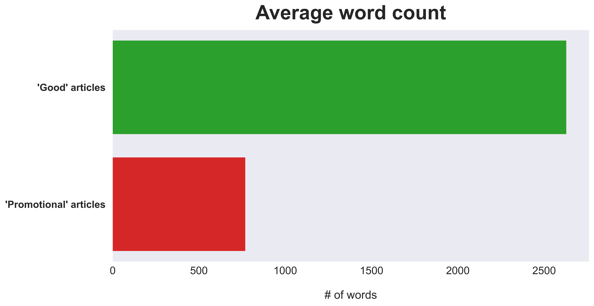

# Predicting Wikipedia Article Quality Using Natural Language Processing


*(photo courtesy of Dmitrij Paskevic, hosted on [Unsplash](https://unsplash.com/photos/YjVa-F9P9kk))*

## Authors

- **Luke Dowker** ([GitHub](https://github.com/toastdeini) | [LinkedIn](https://www.linkedin.com/in/luke-dowker/) | [Email](mailto:lhdowker@gmail.com))

## Overview

Over the course of its twenty-plus-year existence, Wikipedia's reputation has gradually evolved from that of a [digital "Wild West"](https://www.cnn.com/2009/TECH/08/26/wikipedia.editors/index.html), [replete with misinformation](https://usatoday30.usatoday.com/news/opinion/editorials/2005-11-29-wikipedia-edit_x.htm), to that of a [meticulously curated](https://en.wikipedia.org/wiki/Vandalism_on_Wikipedia#Prevention) and (generally) reliable resource for [fact-checking](https://en.wikipedia.org/wiki/Wikipedia_and_fact-checking) & bird's-eye/survey-level research.

The site's reliability and ongoing improvement can be attributed, in large part, to the fastidiousness of Wikipedia's volunteer editors, who have been using Bayesian statistics for at least fifteen years now to identify ["vandalism"](https://en.wikipedia.org/wiki/Wikipedia:Vandalism) - bad-faith edits "deliberately intended to obstruct" the distribution of verifiable, open-source knowledge - with scripts like [ClueBot](https://en.wikipedia.org/wiki/User:ClueBot_NG).

## Business Problem

Create a tool/model/application with natural language processing (NLP) that can predict whether a body of text, e.g. a Wikipedia article, meets objective standards of quality or if it is marked by a promotional tone, indicating potential for bias. An effective product will benefit both stakeholders at Wikipedia and the website's users.

## Data

Data used in this project is freely available for download on [Kaggle](https://www.kaggle.com/datasets/urbanbricks/wikipedia-promotional-articles), courtesy of user `urbanbricks`. "[Good articles](https://en.wikipedia.org/wiki/Wikipedia:Good_articles)" - articles which meet a "core set of editorial standards" - were stored as strings (with corresponding URLs) in one CSV file, `good.csv`. Articles with a "[promotional tone](https://en.wikipedia.org/wiki/Category:Articles_with_a_promotional_tone)" were stored in a separate CSV (`promotional.csv`) that, in addition to `text` and `url` columns, contains one-hot encoded columns that identify a subclass of promotional tone, e.g. `advert` (written like an advertisement) or `coi` (conflict of interest with subject).

Inquiry into the distribution of those subclasses led me to adopt a binary classification approach for this project: a **decisive majority** (just under 80%) of documents in `promotional.csv` are labeled as `advert`, while the next most frequently occurring subclass — `resume` — appeared as a tag on 9.2% of the promotional articles. More specialized work in this domain might involve multi-class predictions, but for the purposes of this project, all articles in `promotional.csv` were treated as 'equally promotional' and assigned a label of **1**.


It is important to note that the classes in discussion here - that is, whether an article meets the criteria for a "good article" or whether its contents are "promotional"/non-neutral - were **evaluated and labeled** by Wikipedia users and editors, and that this dataset (and consequently, these two classes) ***do not*** represent the full corpus of English-language Wikipedia — only a fraction of it, in fact.

A brief inquiry into the *length* of the documents belonging to each class revealed that `good` articles are, on average, about **three to four times longer** than `promotional` articles, and that **more than half** of articles in the `promotional` set are less than 500 words long. This is descriptive, not predictive, but it helps enhance our understanding of the data.

---



---


---

## Methods

### Tools Used + Baseline Model

Initial exploration & analysis of the data utilized the [pandas](https://pandas.pydata.org/docs/index.html#) library for Python; exploratory visualizations were created using [matplotlib](https://matplotlib.org/) and [seaborn](https://seaborn.pydata.org/). Preprocessing the data required modules from both [scikit-learn](https://scikit-learn.org/stable/) and [NLTK](https://www.nltk.org/index.html) (Natural Language Toolkit).

Two vectorization methods were tested for each algorithm employed: a simple bag-of-words approach (`CountVectorizer`) and a term importance approach (`TfidfVectorizer`). Results are reported for each vectorizer.

scikit-learn's `DummyClassifier` acted as a baseline model, against which other algorithms could be compared. The `DummyClassifier` returned an accuracy score of **0.560**, i.e. the proportion of the majority class (`good` articles) in the dataset. Any algorithm that predicts with a lower accuracy score than the dummy is effectively worthless, as far as we're concerned, and we'll be looking to improve substantially on that 56% accuracy rate in the iterative modeling process.

### Iterative Modeling

Modeling began with two straightforward classification algorithms: decision trees (`DecisionTreeClassifier`) and multinomial naive Bayes (`MultinomialNB`). With no hyperparameter tuning, cross-validation results were as follows:

- `DecisionTreeClassifier`:
  - `CountVectorizer`
    - Accuracy: `0.872`
    - F1 score (macro): `0.870`
  - `TfidfVectorizer`
    - Accuracy: `0.864`
    - F1 score (macro): `0.861`
- `MultinomialNB`:
  - `CountVectorizer`
    - Accuracy: `0.898`
    - F1 score (macro): `0.896`
  - `TfidfVectorizer`
    - Accuracy: `0.793`
    - F1 score (macro): `0.770`

### Final Model for Testing

The massively popular gradient boosting library [XGBoost](https://xgboost.readthedocs.io/en/stable/) proved most effective in accurately identifying an article as "promotional."

## Results

<!-- Visualization of error - ROC curve? -->

## Conclusions

- **Recommendation:** Justification
- **Recommendation:** Justification
- **Recommendation:** Justification

### Next Steps

- **Next step:** Justification
- **Next step:** Justification
- **Next step:** Justification

## Repository Structure

```text
├── data
├── images
├── src
├── README.md
├── presentation.pdf
└── Final_Notebook.ipynb
```

## Further Reading and Citations

- Link to [Jupyter notebook](Final_Notebook.ipynb)
- Link to [non-technical presentation](presentation.pdf)
